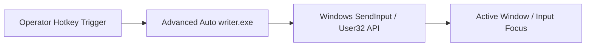
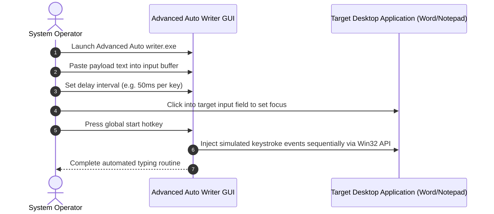

# Advanced Auto Writer — Desktop Keystroke Automation Utility

[]()
[]()
[]()

## Overview
Advanced Auto Writer is a Windows desktop utility designed for automated text entry, macro replay, and typing automation. It allows users to simulate human-speed or high-velocity keystroke sequences across desktop applications, terminal emulators, and document editors.

## Features
- **Automated Keystroke Simulation:** Emulates hardware keyboard scan-codes for text streams.
- **Variable Typing Delay:** Customizable keystroke interval to simulate realistic typing rhythm.
- **Global Hotkey Trigger:** Configurable pause, resume, and abort shortcuts.
- **Clipboard Integration:** Auto-streams clipboard buffers into active target windows.

## Architecture


## User Flow


## Technology Stack
| Layer | Technology | Purpose |
|---|---|---|
| Platform | Windows Desktop (x86/x64) | Target execution operating system |
| Runtime | Win32 / Native Executable | Low-level keyboard hook and event injection |
| Distribution | Standalone Portable Binary (.exe) | Zero-installation portable utility |

## Infrastructure
- **Operating System:** Windows 10 / 11 (64-bit or 32-bit)
- **Privilege Requirement:** Standard user (Elevated / Administrator required when targeting elevated applications).

## Project Structure
```text
auto/
├── Advanced Auto writer.exe  # Standalone Windows portable executable
├── .gitignore                # Git ignore definitions
└── README.md                 # Technical documentation
```

## Prerequisites
- Microsoft Windows 10 or Windows 11
- Visual C++ Redistributable (if dynamically linked)

## Environment Variables
*Not applicable. Configuration is managed via the graphical interface.*

## Local Development Setup
1. Clone the repository:
   ```bash
   git clone https://github.com/Bhanutejanallamothu/auto.git
   cd auto
   ```
2. Double-click `Advanced Auto writer.exe` to launch the utility.
3. Paste target text into the input field.
4. Set keystroke delay (in milliseconds).
5. Switch to target application and activate the trigger hotkey.

## Docker Setup
*Not applicable. Windows desktop graphical executable.*

## Database Setup
*Not applicable. Application operates entirely in-memory.*

## API Documentation
*Not applicable. Standalone desktop GUI executable.*

## Deployment
Copy `Advanced Auto writer.exe` to any Windows workstation or portable USB drive.

## Security
- Always scan external binaries with Windows Defender or an enterprise antivirus suite before execution.
- Tool should only be executed on authorized endpoints for legitimate data entry automation.

## Testing
Launch binary in a test sandbox environment (e.g. Windows Sandbox) and verify typing into Notepad.

## Troubleshooting
- **Input Ignored by Target Application:** Run `Advanced Auto writer.exe` as Administrator if the target application is running with elevated privileges (UIPI restrictions).

## Future Improvements
- Source code restoration and open-source migration to C# .NET or Rust.
- Cross-platform support for Linux (via X11/Wayland `uinput`) and macOS.

## License
Proprietary utility. All rights reserved by repository owner.
